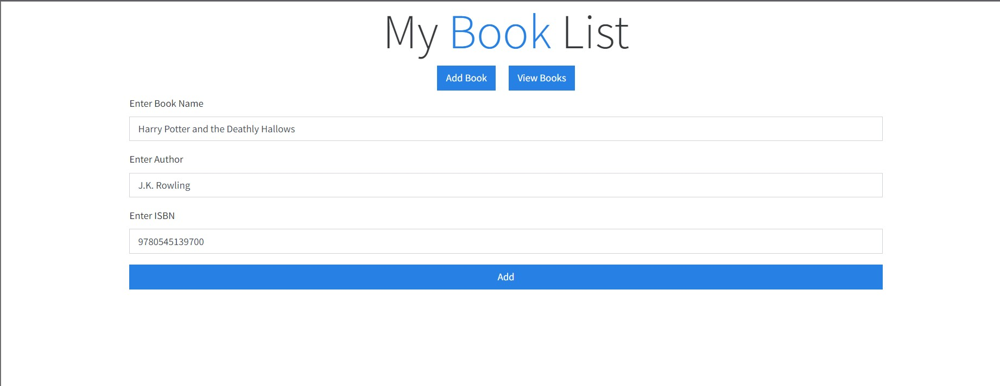
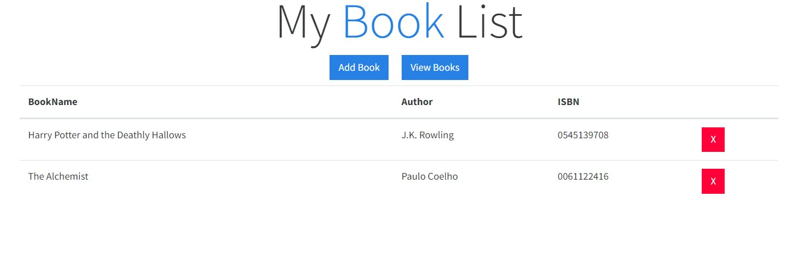

# BOOKLIST APP

### Overview
This is a simple app which has two sections. The first one is a form where you can enter details about a book. The second section is a Table where you will see the list of the books that you have saved.The app looks like this.

___

### Techonologies Used
* HTML
* CSS (Bootstrap)
* Javascript 

### Functioning
 
The app simply takes the data entered in the form, validates it and saves using local storage API. When we Click on the view books button it loads the list of the books that we have saved. We can delete books from this list if we want. Since it uses local storage so the data will be stored even if we close the browser.

### Things I learned during the making of this app
* Logic for Validating an ISBN
* Pagination
* Basics of bootstrap

